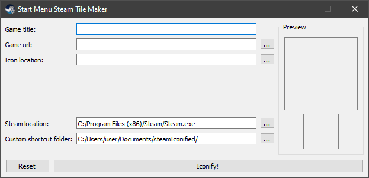
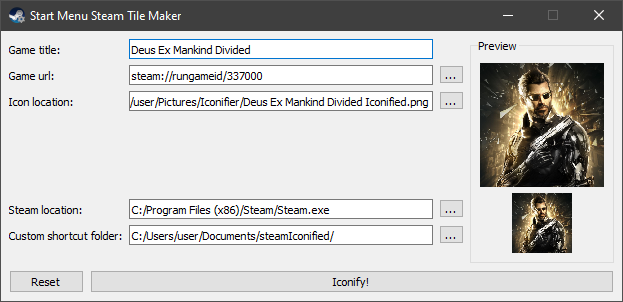
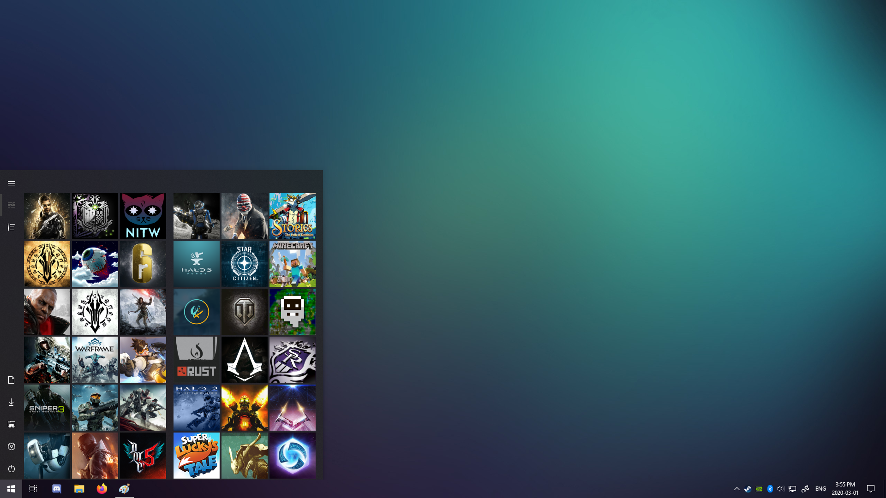

# Start menu steam tile maker
Based on TileIconifier's custom shortcut system that is used to make steam tiles.

**This app is a work in progress but is currently working**

I Made a little app to make steam tile in the start menu faster because TileIconifier's custom shortcut isn't perfect for url shortcut.

## Preview

## How this works
This app will work like TileIconify's custom shorcut feature. I used this option a lot to create a better looking start menu that contains all of my games and it required a lot of effort to make the game launchable. So this script will only require the game's name, the game's url (can be obtained from the game's url file/shortcut) and the image you wish to use for the tile. The custom shortcut folder is where the vbs file with visual elements will be created. Once all set, click Iconify! and a new tile will be waiting for you in the TileIconify folder located in the start menu.

## [Link to TileIconifier](https://github.com/Jonno12345/TileIconifier/releases)